# [📈 Live Status](https://Ryanjiena.github.io/upptime): <!--live status--> **🟥 Complete outage**

This repository contains the open-source uptime monitor and status page for [Ryanjie](https://www.ryanjie.xyz), powered by [Upptime](https://github.com/upptime/upptime).

With [Upptime](https://upptime.js.org), you can get your own unlimited and free uptime monitor and status page, powered entirely by a GitHub repository. We use [Issues](https://github.com/Ryanjiena/upptime/issues) as incident reports, [Actions](https://github.com/Ryanjiena/upptime/actions) as uptime monitors, and [Pages](https://Ryanjiena.github.io/upptime) for the status page.

<!--start: status pages-->
<!-- This summary is generated by Upptime (https://github.com/upptime/upptime) -->
<!-- Do not edit this manually, your changes will be overwritten -->

| URL                                                      | Status  | History                                                                                                                        | Response Time                                                                                    | Uptime                                                                                                                                                                                                                                                    |
| -------------------------------------------------------- | ------- | ------------------------------------------------------------------------------------------------------------------------------ | ------------------------------------------------------------------------------------------------ | --------------------------------------------------------------------------------------------------------------------------------------------------------------------------------------------------------------------------------------------------------- |
| [Coding](https://coding.net)                             | 🟥 Down | [coding.yml](https://github.com/Ryanjiena/upptime/commits/master/history/coding.yml)                                           | 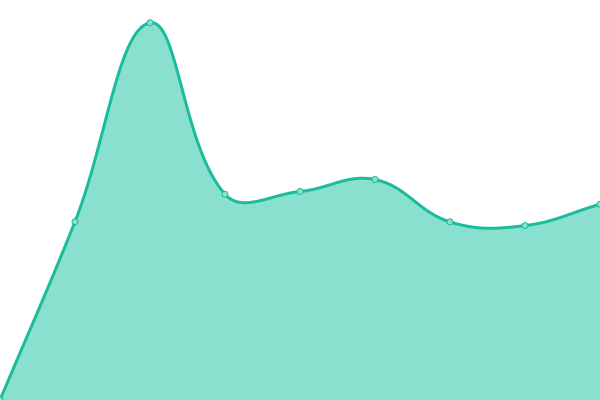 2325ms                     |                                           |
| [Gitee](https://gitee.com)                               | 🟥 Down | [gitee.yml](https://github.com/Ryanjiena/upptime/commits/master/history/gitee.yml)                                             | 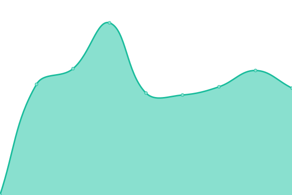 1896ms                      |                                             |
| [Github](https://github.com)                             | 🟥 Down | [github.yml](https://github.com/Ryanjiena/upptime/commits/master/history/github.yml)                                           | 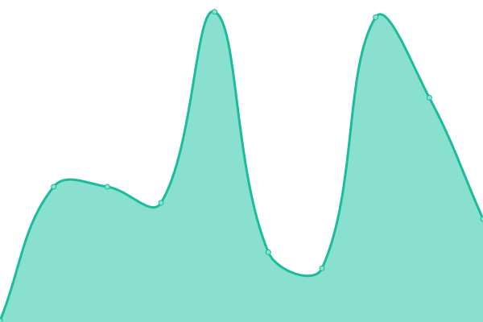 150ms                      |                                           |
| [Github Status](https://www.githubstatus.com)            | 🟥 Down | [github-status.yml](https://github.com/Ryanjiena/upptime/commits/master/history/github-status.yml)                             | 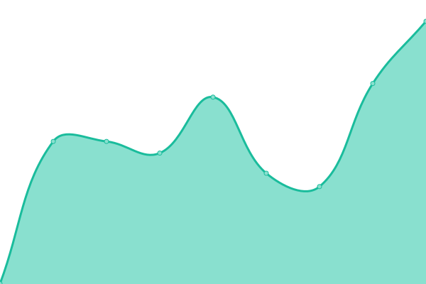 508ms               |                             |
| [Ryanjie Blog](https://www.ryanjie.cn)                   | 🟥 Down | [ryanjie-blog.yml](https://github.com/Ryanjiena/upptime/commits/master/history/ryanjie-blog.yml)                               |  15474ms              |                                |
| [Ryanjie Drive](https://gd.ryanjie.cn)                   | 🟥 Down | [ryanjie-drive.yml](https://github.com/Ryanjiena/upptime/commits/master/history/ryanjie-drive.yml)                             | 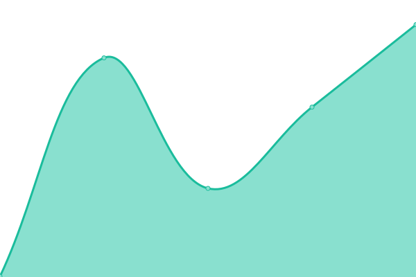 323ms               |                             |
| [Ryanjie Github](https://git.ryanjie.cn)                 | 🟥 Down | [ryanjie-github.yml](https://github.com/Ryanjiena/upptime/commits/master/history/ryanjie-github.yml)                           | 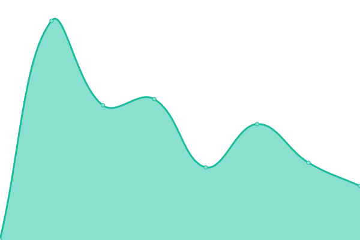 484ms              |                           |
| [Ryanjie Google](https://gg.fgh.workers.dev)             | 🟥 Down | [ryanjie-google.yml](https://github.com/Ryanjiena/upptime/commits/master/history/ryanjie-google.yml)                           | 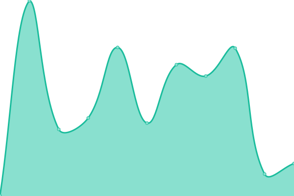 312ms              |                            |
| [Ryanjie Google Scholar](https://gs.ryanjie.cn)          | 🟥 Down | [ryanjie-google-scholar.yml](https://github.com/Ryanjiena/upptime/commits/master/history/ryanjie-google-scholar.yml)           | 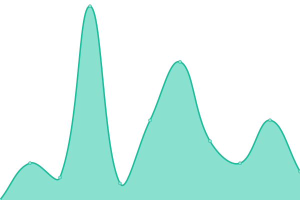 609ms      |            |
| [Ryanjie Hexo Blog](https://hexo.ryanjie.cn)             | 🟥 Down | [ryanjie-hexo-blog.yml](https://github.com/Ryanjiena/upptime/commits/master/history/ryanjie-hexo-blog.yml)                     | 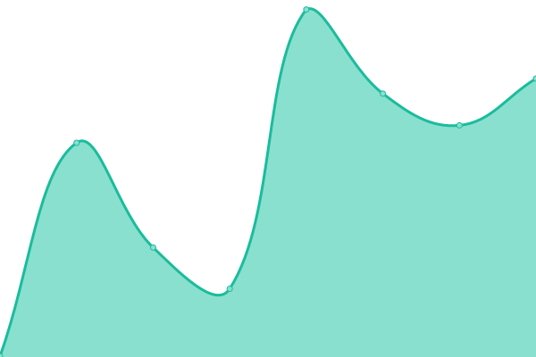 272ms           |                     |
| [Ryanjie Img](https://img.ryanjie.cn)                    | 🟥 Down | [ryanjie-img.yml](https://github.com/Ryanjiena/upptime/commits/master/history/ryanjie-img.yml)                                 |  3060ms                |                                  |
| [Ryanjie Learn](https://learn.ryanjie.cn)                | 🟥 Down | [ryanjie-learn.yml](https://github.com/Ryanjiena/upptime/commits/master/history/ryanjie-learn.yml)                             | 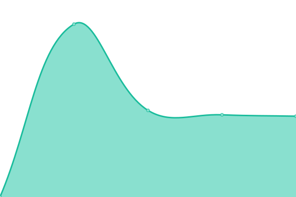 2300ms              |                             |
| [Ryanjie Movie](https://movie.ryanjie.cn)                | 🟥 Down | [ryanjie-movie.yml](https://github.com/Ryanjiena/upptime/commits/master/history/ryanjie-movie.yml)                             | 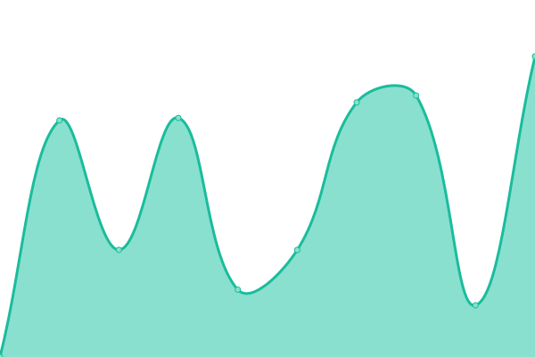 3057ms              |                              |
| [Ryanjie Onedrive](https://file.ryanjie.cn)              | 🟥 Down | [ryanjie-onedrive.yml](https://github.com/Ryanjiena/upptime/commits/master/history/ryanjie-onedrive.yml)                       |  0ms              |                        |
| [Ryanjie Pic](https://pic.ryanjie.cn)                    | 🟥 Down | [ryanjie-pic.yml](https://github.com/Ryanjiena/upptime/commits/master/history/ryanjie-pic.yml)                                 |  2656ms                |                                  |
| [Ryanjie Pornhub](https://ph.ryanjie.cn)                 | 🟥 Down | [ryanjie-pornhub.yml](https://github.com/Ryanjiena/upptime/commits/master/history/ryanjie-pornhub.yml)                         |  681ms             |                         |
| [Ryanjie Profile](https://m.ryanjie.cn)                  | 🟥 Down | [ryanjie-profile.yml](https://github.com/Ryanjiena/upptime/commits/master/history/ryanjie-profile.yml)                         | 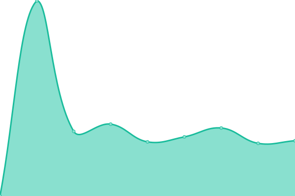 1649ms            |                         |
| [Ryanjie RSSHUB](https://rss.ryanjie.cn)                 | 🟥 Down | [ryanjie-rsshub.yml](https://github.com/Ryanjiena/upptime/commits/master/history/ryanjie-rsshub.yml)                           | 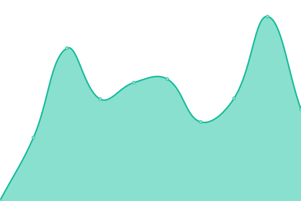 236ms              |                           |
| [Ryanjie Status](https://ss.ryanjie.cn)                  | 🟥 Down | [ryanjie-status.yml](https://github.com/Ryanjiena/upptime/commits/master/history/ryanjie-status.yml)                           | 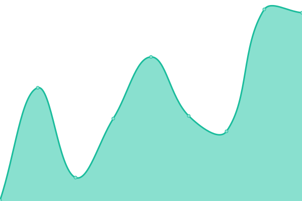 151ms              |                           |
| [Ryanjie Uptime Robot Status](https://status.ryanjie.cn) | 🟥 Down | [ryanjie-uptime-robot-status.yml](https://github.com/Ryanjiena/upptime/commits/master/history/ryanjie-uptime-robot-status.yml) |  866ms |  |
| [Ryanjie Wikipedia EN](https://ewp.ryanjie.cn)           | 🟥 Down | [ryanjie-wikipedia-en.yml](https://github.com/Ryanjiena/upptime/commits/master/history/ryanjie-wikipedia-en.yml)               | 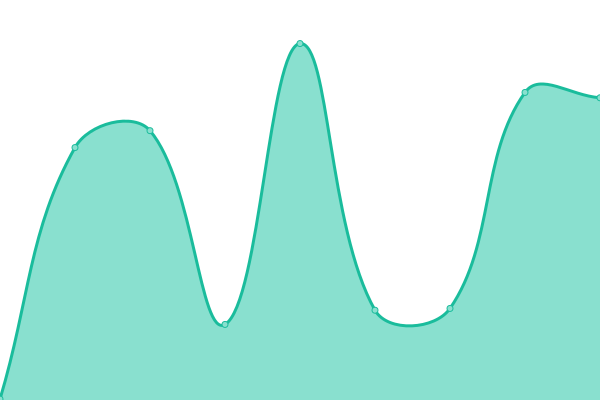 231ms        |               |
| [Ryanjie Wikipedia ZH](https://zwp.ryanjie.cn)           | 🟥 Down | [ryanjie-wikipedia-zh.yml](https://github.com/Ryanjiena/upptime/commits/master/history/ryanjie-wikipedia-zh.yml)               | 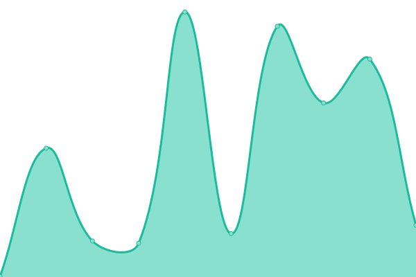 288ms        |               |
| [Ryanjie WorkProject](https://project.ryanjie.cn)        | 🟥 Down | [ryanjie-work-project.yml](https://github.com/Ryanjiena/upptime/commits/master/history/ryanjie-work-project.yml)               | 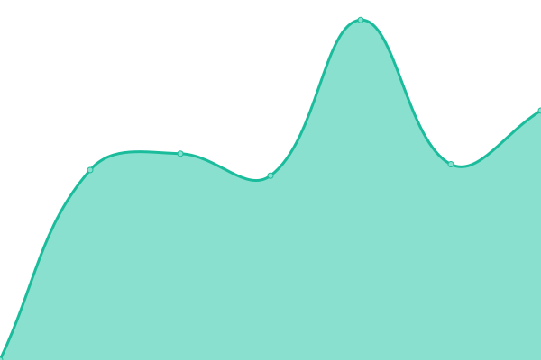 1844ms       |               |

<!--end: status pages-->

[**Visit our status website →**](https://Ryanjiena.github.io/upptime)

## 📄 License

- Code: [MIT](./LICENSE) © [Ryanjie](https://www.ryanjie.xyz)
- Data in the `./history` directory: [Open Database License](https://opendatacommons.org/licenses/odbl/1-0/)
