# [📈 Live Status](https://Ryanjiena.github.io/upptime): <!--live status--> **🟥 Complete outage**

This repository contains the open-source uptime monitor and status page for [Ryanjie](https://www.ryanjie.xyz), powered by [Upptime](https://github.com/upptime/upptime).

With [Upptime](https://upptime.js.org), you can get your own unlimited and free uptime monitor and status page, powered entirely by a GitHub repository. We use [Issues](https://github.com/Ryanjiena/upptime/issues) as incident reports, [Actions](https://github.com/Ryanjiena/upptime/actions) as uptime monitors, and [Pages](https://Ryanjiena.github.io/upptime) for the status page.

<!--start: status pages-->
<!-- This summary is generated by Upptime (https://github.com/upptime/upptime) -->
<!-- Do not edit this manually, your changes will be overwritten -->
<!-- prettier-ignore -->
| URL | Status | History | Response Time | Uptime |
| --- | ------ | ------- | ------------- | ------ |
|  [Coding](https://coding.net) | 🟥 Down | [coding.yml](https://github.com/Ryanjiena/upptime/commits/HEAD/history/coding.yml) | 

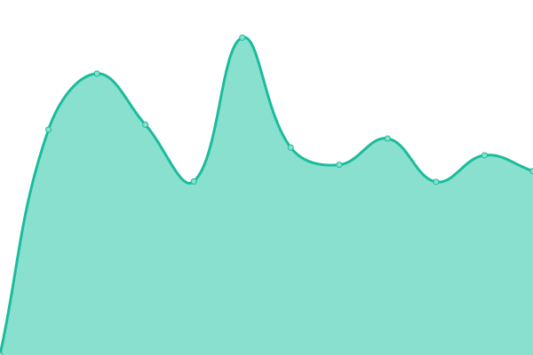 2882ms
     
 | 

<a href="https://Ryanjiena.github.io/upptime/history/coding">100.00%</a>
    

|  [Gitee](https://gitee.com) | 🟥 Down | [gitee.yml](https://github.com/Ryanjiena/upptime/commits/HEAD/history/gitee.yml) | 

 1689ms
     
 | 

<a href="https://Ryanjiena.github.io/upptime/history/gitee">100.00%</a>
    

|  [Github](https://github.com) | 🟥 Down | [github.yml](https://github.com/Ryanjiena/upptime/commits/HEAD/history/github.yml) | 

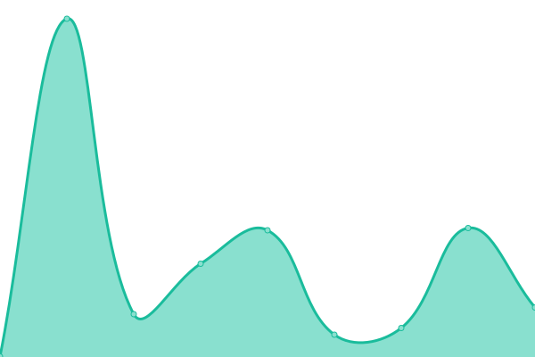 78ms
     
 | 

<a href="https://Ryanjiena.github.io/upptime/history/github">100.00%</a>
    

|  [Github Status](https://www.githubstatus.com) | 🟥 Down | [github-status.yml](https://github.com/Ryanjiena/upptime/commits/HEAD/history/github-status.yml) | 

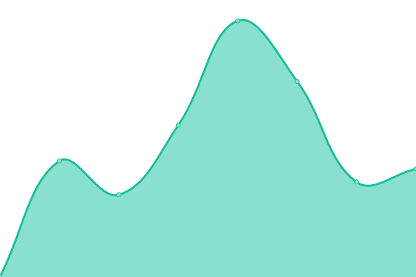 414ms
     
 | 

<a href="https://Ryanjiena.github.io/upptime/history/github-status">100.00%</a>
    

|  [Ryanjie Blog](https://www.ryanjie.cn) | 🟥 Down | [ryanjie-blog.yml](https://github.com/Ryanjiena/upptime/commits/HEAD/history/ryanjie-blog.yml) | 

 0ms
     
 | 

<a href="https://Ryanjiena.github.io/upptime/history/ryanjie-blog">100.00%</a>
    

|  [Ryanjie Drive](https://gd.ryanjie.cn) | 🟥 Down | [ryanjie-drive.yml](https://github.com/Ryanjiena/upptime/commits/HEAD/history/ryanjie-drive.yml) | 

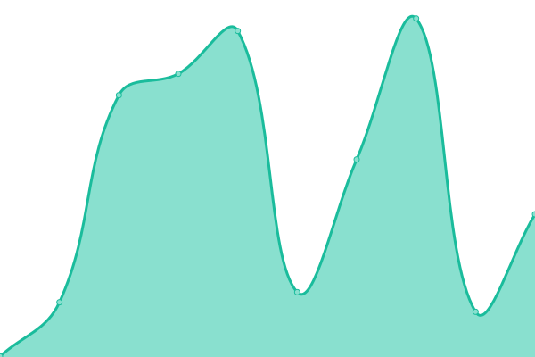 0ms
     
 | 

<a href="https://Ryanjiena.github.io/upptime/history/ryanjie-drive">0.00%</a>
    

|  [Ryanjie Github](https://git.ryanjie.cn) | 🟥 Down | [ryanjie-github.yml](https://github.com/Ryanjiena/upptime/commits/HEAD/history/ryanjie-github.yml) | 

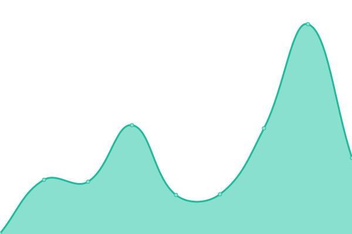 0ms
     
 | 

<a href="https://Ryanjiena.github.io/upptime/history/ryanjie-github">0.00%</a>
    

|  [Ryanjie Google](https://gg.fgh.workers.dev) | 🟥 Down | [ryanjie-google.yml](https://github.com/Ryanjiena/upptime/commits/HEAD/history/ryanjie-google.yml) | 

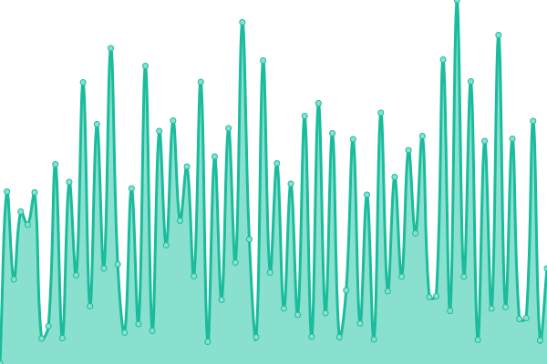 342ms
     
 | 

<a href="https://Ryanjiena.github.io/upptime/history/ryanjie-google">90.37%</a>
    

|  [Ryanjie Google Scholar](https://gs.ryanjie.cn) | 🟥 Down | [ryanjie-google-scholar.yml](https://github.com/Ryanjiena/upptime/commits/HEAD/history/ryanjie-google-scholar.yml) | 

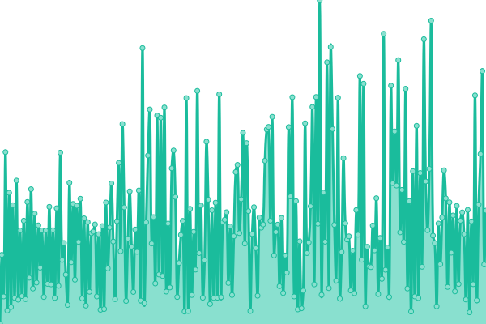 0ms
     
 | 

<a href="https://Ryanjiena.github.io/upptime/history/ryanjie-google-scholar">0.00%</a>
    

|  [Ryanjie Hexo Blog](https://hexo.ryanjie.cn) | 🟥 Down | [ryanjie-hexo-blog.yml](https://github.com/Ryanjiena/upptime/commits/HEAD/history/ryanjie-hexo-blog.yml) | 

 0ms
     
 | 

<a href="https://Ryanjiena.github.io/upptime/history/ryanjie-hexo-blog">0.00%</a>
    

|  [Ryanjie Img](https://img.ryanjie.cn) | 🟥 Down | [ryanjie-img.yml](https://github.com/Ryanjiena/upptime/commits/HEAD/history/ryanjie-img.yml) | 

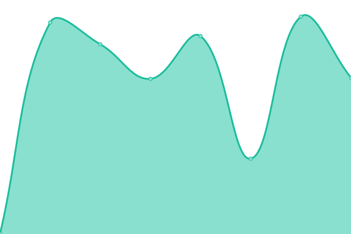 0ms
     
 | 

<a href="https://Ryanjiena.github.io/upptime/history/ryanjie-img">100.00%</a>
    

|  [Ryanjie Learn](https://learn.ryanjie.cn) | 🟥 Down | [ryanjie-learn.yml](https://github.com/Ryanjiena/upptime/commits/HEAD/history/ryanjie-learn.yml) | 

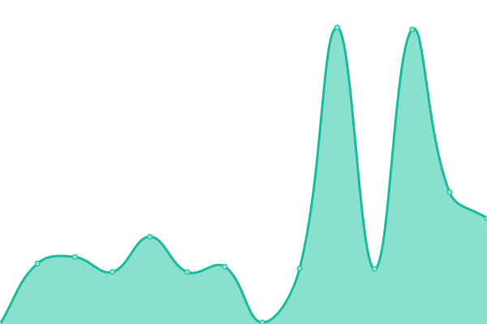 0ms
     
 | 

<a href="https://Ryanjiena.github.io/upptime/history/ryanjie-learn">0.00%</a>
    

|  [Ryanjie Movie](https://movie.ryanjie.cn) | 🟥 Down | [ryanjie-movie.yml](https://github.com/Ryanjiena/upptime/commits/HEAD/history/ryanjie-movie.yml) | 

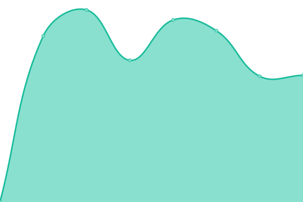 0ms
     
 | 

<a href="https://Ryanjiena.github.io/upptime/history/ryanjie-movie">100.00%</a>
    

|  [Ryanjie Onedrive](https://file.ryanjie.cn) | 🟥 Down | [ryanjie-onedrive.yml](https://github.com/Ryanjiena/upptime/commits/HEAD/history/ryanjie-onedrive.yml) | 

 0ms
     
 | 

<a href="https://Ryanjiena.github.io/upptime/history/ryanjie-onedrive">100.00%</a>
    

|  [Ryanjie Pic](https://pic.ryanjie.cn) | 🟥 Down | [ryanjie-pic.yml](https://github.com/Ryanjiena/upptime/commits/HEAD/history/ryanjie-pic.yml) | 

 0ms
     
 | 

<a href="https://Ryanjiena.github.io/upptime/history/ryanjie-pic">100.00%</a>
    

|  [Ryanjie Pornhub](https://ph.ryanjie.cn) | 🟥 Down | [ryanjie-pornhub.yml](https://github.com/Ryanjiena/upptime/commits/HEAD/history/ryanjie-pornhub.yml) | 

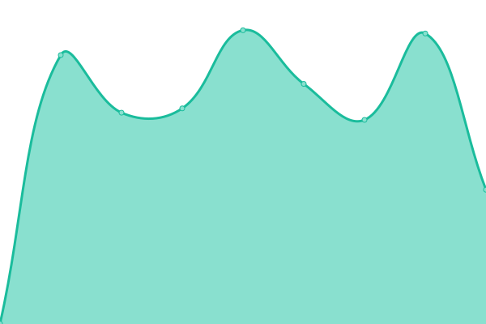 0ms
     
 | 

<a href="https://Ryanjiena.github.io/upptime/history/ryanjie-pornhub">0.00%</a>
    

|  [Ryanjie Profile](https://m.ryanjie.cn) | 🟥 Down | [ryanjie-profile.yml](https://github.com/Ryanjiena/upptime/commits/HEAD/history/ryanjie-profile.yml) | 

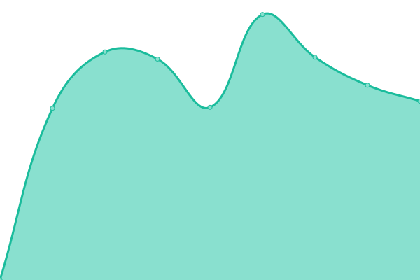 0ms
     
 | 

<a href="https://Ryanjiena.github.io/upptime/history/ryanjie-profile">0.00%</a>
    

|  [Ryanjie RSSHUB](https://rss.ryanjie.cn) | 🟥 Down | [ryanjie-rsshub.yml](https://github.com/Ryanjiena/upptime/commits/HEAD/history/ryanjie-rsshub.yml) | 

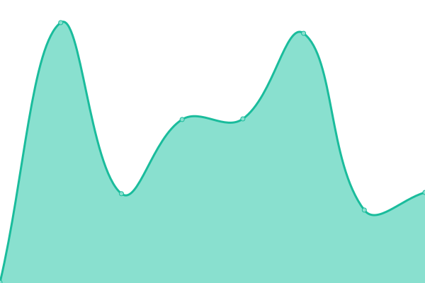 0ms
     
 | 

<a href="https://Ryanjiena.github.io/upptime/history/ryanjie-rsshub">0.00%</a>
    

|  [Ryanjie Status](https://ss.ryanjie.cn) | 🟥 Down | [ryanjie-status.yml](https://github.com/Ryanjiena/upptime/commits/HEAD/history/ryanjie-status.yml) | 

 0ms
     
 | 

<a href="https://Ryanjiena.github.io/upptime/history/ryanjie-status">0.00%</a>
    

|  [Ryanjie Uptime Robot Status](https://status.ryanjie.cn) | 🟥 Down | [ryanjie-uptime-robot-status.yml](https://github.com/Ryanjiena/upptime/commits/HEAD/history/ryanjie-uptime-robot-status.yml) | 

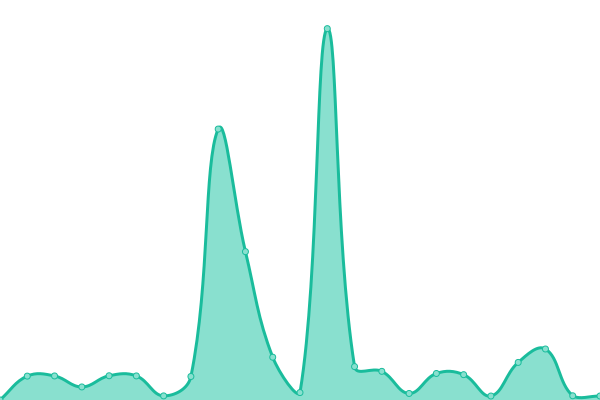 0ms
     
 | 

<a href="https://Ryanjiena.github.io/upptime/history/ryanjie-uptime-robot-status">0.00%</a>
    

|  [Ryanjie Wikipedia EN](https://ewp.ryanjie.cn) | 🟥 Down | [ryanjie-wikipedia-en.yml](https://github.com/Ryanjiena/upptime/commits/HEAD/history/ryanjie-wikipedia-en.yml) | 

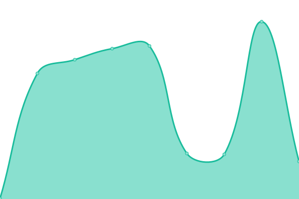 0ms
     
 | 

<a href="https://Ryanjiena.github.io/upptime/history/ryanjie-wikipedia-en">0.00%</a>
    

|  [Ryanjie Wikipedia ZH](https://zwp.ryanjie.cn) | 🟥 Down | [ryanjie-wikipedia-zh.yml](https://github.com/Ryanjiena/upptime/commits/HEAD/history/ryanjie-wikipedia-zh.yml) | 

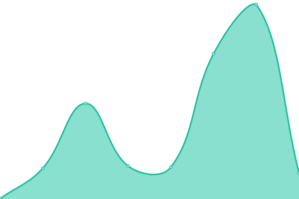 0ms
     
 | 

<a href="https://Ryanjiena.github.io/upptime/history/ryanjie-wikipedia-zh">0.00%</a>
    

|  [Ryanjie WorkProject](https://project.ryanjie.cn) | 🟥 Down | [ryanjie-work-project.yml](https://github.com/Ryanjiena/upptime/commits/HEAD/history/ryanjie-work-project.yml) | 

 0ms
     
 | 

<a href="https://Ryanjiena.github.io/upptime/history/ryanjie-work-project">0.00%</a>
    

<!--end: status pages-->

[**Visit our status website →**](https://Ryanjiena.github.io/upptime)

## 📄 License

- Code: [MIT](./LICENSE) © [Ryanjie](https://www.ryanjie.xyz)
- Data in the `./history` directory: [Open Database License](https://opendatacommons.org/licenses/odbl/1-0/)
